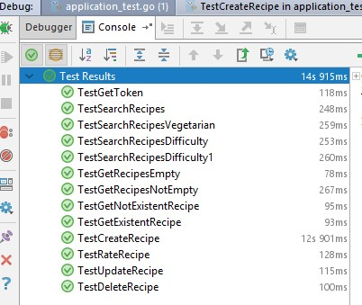
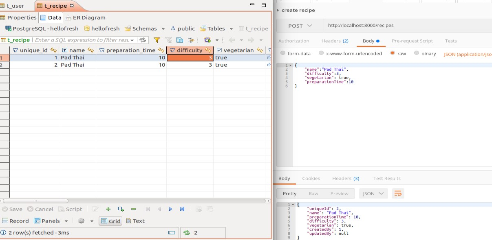
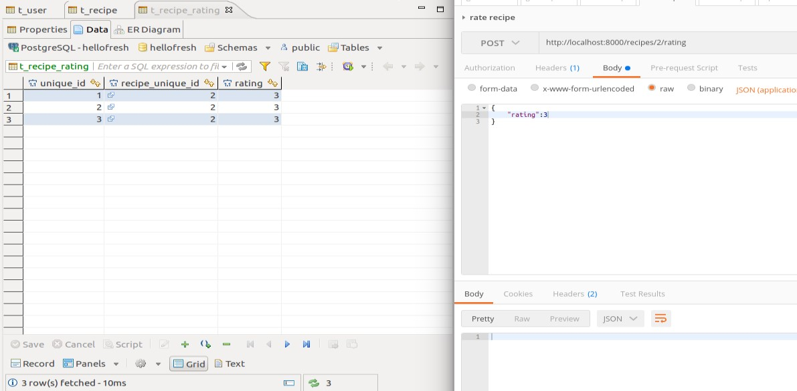
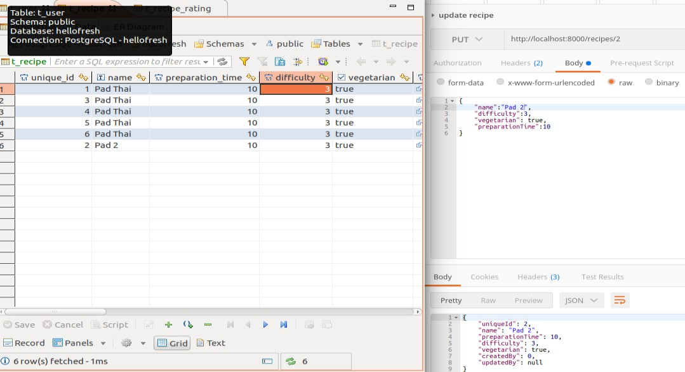
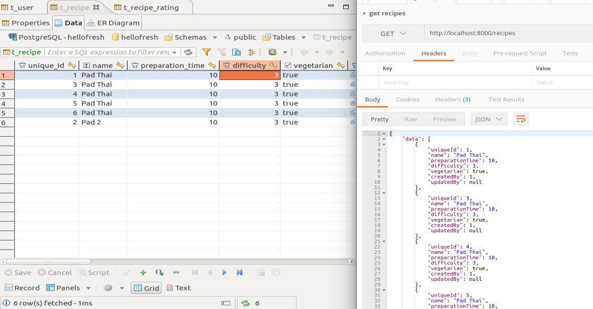
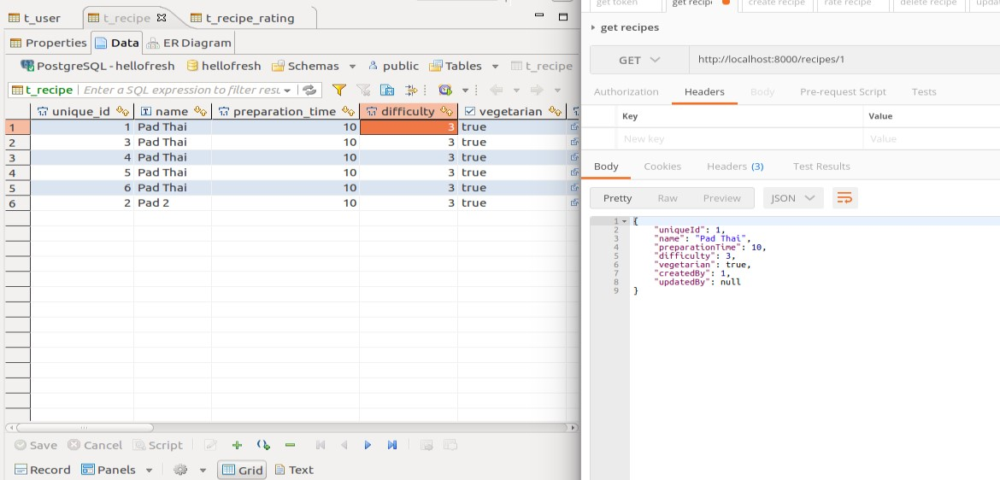
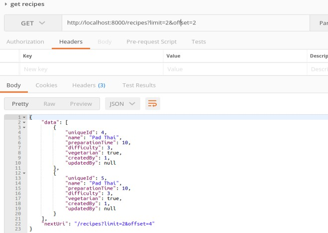
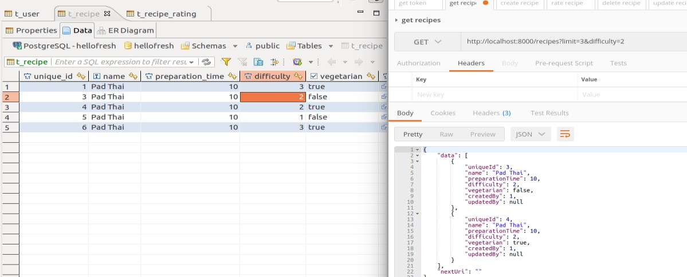
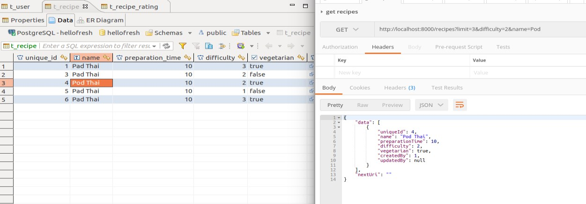

# SetUp instructions

There are three requisites:
 - git must be installed with version 2.7.4
 - docker must be installed with version 1.13.1
 - docker-compose must be installed with version 1.11.1

To start the application
```bash
curl -o start.sh https://raw.githubusercontent.com/jsotogaviard/starter/master/start.sh
./start.sh
```

You can check the service is up by calling:
```bash
curl http://localhost:8000/recipes
```

It should answer
```
{
    "Data": [],
    "NextUri": ""
}
```

You need to create a user in the database (t_user table) to be able
to create/update/delete recipes. 
```sql
INSERT INTO public.t_user
(unique_id, login, hashed_password)
VALUES(1, 'login', 'hashed_password');
```

Then you need to retrieve the token that is going to be used for all write operations.
For this you need add a header to the query:
- Authorization: Bearer {token}

# Used technologies

## Router

I have used the most common router : gorilla/mux.
It has an active community (63 contributors) and recent commits (a few days ago)

## Database Access Abstraction

I have used 'Masterminds\squirrel' since it has the most active community (18 contributors) and recent commits (last commit two months ago)

## Database migration

I have used 'rubenv\sql-migrate' since it has the most active community (26 contributors) and recent commits (3 days ago)

## JWT

I have used jwt for authentication. This way we avoid requesting the database to authorize the user

## Testing

# Unit test

The unit test need to be added to check each component independently

# Integration test
Some integration tests have been done


# Manual test

Some manual tests have been done:
 - Create recipe


- Rate recipe


- Update recipe


- Get recipes


- Get recipe


- Search recipe with limit and offset


- Search recipe with limit and offset


- Search recipe with difficulty


- Search recipe with difficulty and name


# Endpoints documentation

The endpoint documentation can be found: doc/recipe.yaml

You can use https://editor.swagger.io/ to read the file

The search endpoint is documented in the get list.
The following parameters can be passes to the query:
 - limit
 - offset
 - difficulty
 - name
 For example:
 ```bash
 curl http://localhost:8000/recipes?limit=2&offset=3&difficulty=2&name=Pad
 ```

# Improvements

- Get recipes with paged ratings
- Get recipes with login for created by and updated by fields
- Calculate the average of rating and stock on the recipe
- Add searching fields : preparation time, created by and updated by
- Add content negotiation
- Migrate to docker stack (version 3.3)
- Add created_at and updated_at for a recipe
- Add versioning of a recipe so we can track the deletion time and who has done it
- Make human readable exceptions
- Read signing key from file
- Implement PATCH method for recipe update

# Difficulties

- Add the usage of healthcheck on docker compose to make sure postgres container is up and running